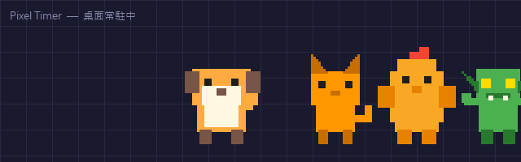
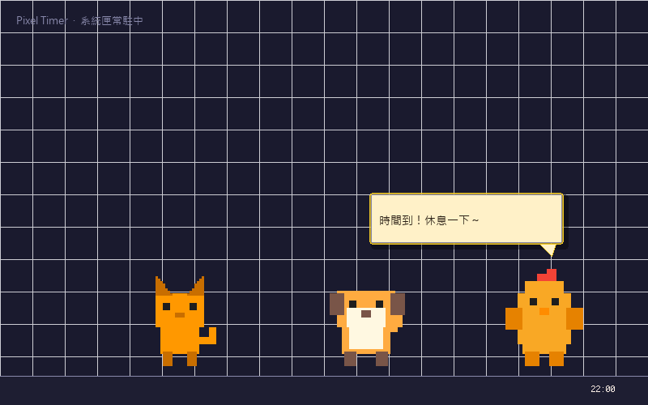
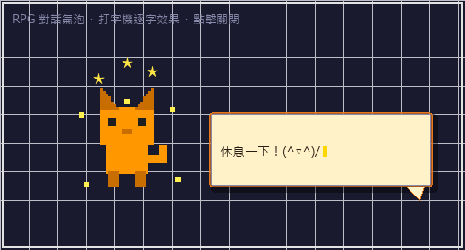
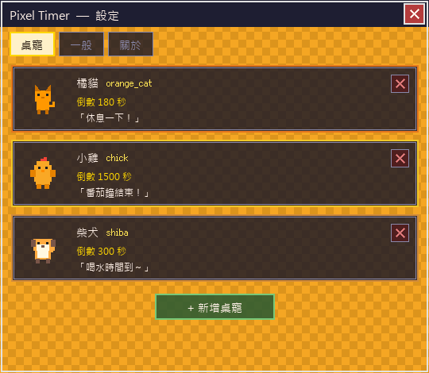
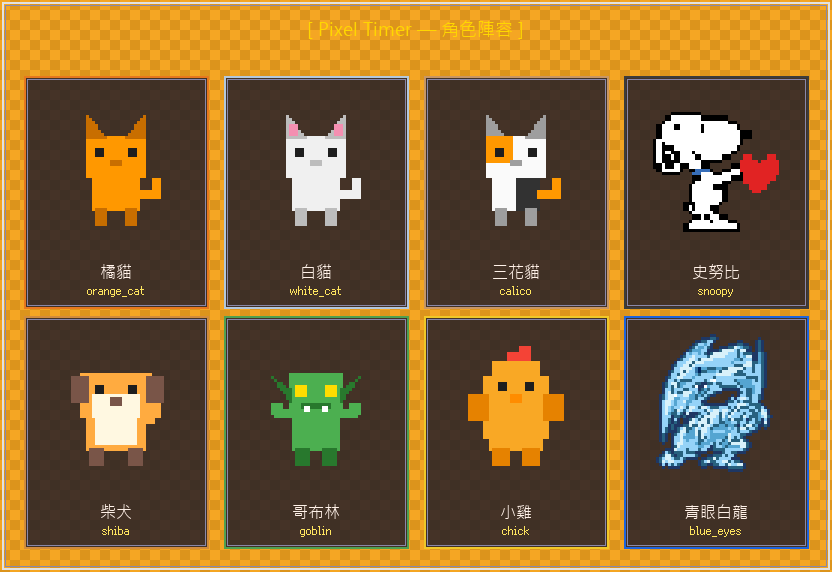

# 🐱 Pixel Timer

> 一群住在你桌面角落的 8-bit 小可愛，專職負責提醒你「欸～該休息了！」

<p align="center">
  
</p>

<p align="center">
  
  
  
  
  
</p>

---

## 這是什麼？

雙擊桌面上的像素寵物 → 牠開始幫你倒數計時 → 時間一到，牠**跳起來、放星星、彈出 RPG 對話氣泡**跟你說「時間到！」

就這樣。沒有什麼無聊的彈窗。只有很可愛的像素生物。

```
  計時中 ── 桌寵上下浮動
    ╭─────────────╮
    │  ( o w o )  │   ↕
    ╰─────────────╯

  時間到 ── 跳起來 ＋ 星星 ＋ 對話氣泡
    ╭─────────────╮
    │  \( ^o^ )/  │   *  *  *
    ╰─────────────╯
       「休息一下！」
```

---

## 截圖

| 桌面桌寵 | RPG 通知氣泡 | 設定介面 |
|:---:|:---:|:---:|
|  |  |  |

<p align="center">
  
  <br><em>8 隻角色，每隻都有 idle / 計時中 / 完成 三種動畫狀態</em>
</p>

---

## 角色陣容

目前共 **8 隻**，全部用 Pillow 程式化生成（對，都是 code 畫的，不是手繪）：

```
   ╭───────╮ ╭───────╮ ╭───────╮ ╭───────╮
   │ =^.^= │ │ =o.o= │ │ =^w^= │ │ (>_<) │
   ╰───────╯ ╰───────╯ ╰───────╯ ╰───────╯
   ╭───────╮ ╭───────╮ ╭───────╮ ╭───────╮
   │ (^o^) │ │ (>O<) │ │ (.v.) │ │ {>o<} │
   ╰───────╯ ╰───────╯ ╰───────╯ ╰───────╯
```

| 角色 ID | 中文名 | 特色 |
|---------|--------|------|
| `orange_cat` | 橘貓 | 標準款，沒有理由不喜歡 |
| `white_cat` | 白貓 | 高冷版橘貓 |
| `calico` | 三花貓 | 色彩繽紛愛好者首選 |
| `snoopy` | 史努比 | 像素直抄 BRIK.co 積木圖案，最正宗 |
| `shiba` | 柴犬 | wow. such timer. very remind. |
| `goblin` | 哥布林 | 給喜歡怪 > 可愛的人 |
| `chick` | 小雞 | 預設角色，嬌小、Q彈、無害 |
| `blue_eyes` | 青眼白龍 | 是的，就是那隻。1px 藍描邊版本。 |

---

## 功能清單

### ⏱️ 計時器
- **雙擊桌寵** 觸發倒數計時（秒數每隻各自設定）
- **計時中**：桌寵上下浮動，讓你知道牠在認真工作中
- **時間到**：跳躍 + 星星特效 + RPG 對話氣泡彈出
  - 氣泡有打字機逐字顯示效果
  - 點擊氣泡可關閉
- **再按一次**快捷鍵 = 取消計時

### ⏰ 鬧鐘
- 每隻桌寵可設多組 HH:MM 鬧鐘
- 重複模式：`once`（用完自動關）/ `daily`（每天） / `weekdays`（週一到五）
- idle 狀態時，hover 桌寵可看到下個鬧鐘時間

### ⌨️ 全域快捷鍵（預設）
| 快捷鍵 | 動作 |
|--------|------|
| `Ctrl+Shift+1` | 3 分鐘計時（休息一下） |
| `Ctrl+Shift+2` | 5 分鐘計時 |
| `Ctrl+Shift+3` | 25 分鐘（番茄鐘） |

> 可在設定頁自由更改快捷鍵和秒數

### 🎨 UI 主題
- **暖色復古**設定介面：橘色 `#F5A623` 棋盤紋背景，像八十年代的電玩機台
- **Ark Pixel Font 12px/16px**：中文 CJK 全支援，像素感拉滿
- **自製像素標題列**（PixelTitleBar），就連視窗關閉按鈕都像素化了
- RPG 通知氣泡：角色代表色外框 + 米色底 + 打字機效果

### 📌 系統常駐
- 住在**系統匣**，關掉設定視窗程式還在
- 桌寵位置記錄在 config，**重開機也記得你把牠擺在哪**
- **永遠置頂**（Win32 API 強制置頂 + 焦點切換即時響應）
- **Win11 相容**：特別修了 DWM 灰色邊框問題

---

## 安裝

### 方法一：直接下載 exe（推薦懶人版）

1. 到 [Releases](https://github.com/dawang-sakura/pixel-timer/releases/tag/v1.0.0) 下載 `PixelTimer.zip`
2. 解壓縮
3. 執行 `PixelTimer.exe`

> ⚠️ **Windows Defender 可能會說它很危險**（鍵盤監聽 = 被防毒誤認為 keylogger）  
> 把執行檔資料夾加入 Windows 安全性的「排除清單」就沒事了，這是 Python 打包的通病

### 方法二：從原始碼執行

```bash
# 1. clone repo
git clone https://github.com/dawang-sakura/pixel-timer.git
cd pixel-timer

# 2. 建 venv（建議放在 repo 外面）
python -m venv ~/.venvs/pixel_timer
source ~/.venvs/pixel_timer/Scripts/activate  # Windows: .venvs/pixel_timer/Scripts/activate.bat

# 3. 裝依賴
pip install -r requirements.txt

# 4. 跑！
python main.py
```

### 方法三：自己打包

```bat
REM 需要 venv 已啟用
build.bat
REM 產出在 dist/PixelTimer/
```

---

## 設定

首次執行自動在 exe 旁邊建立 `config/settings.json`，格式長這樣：

```json
{
  "pets": [
    {
      "id": "pet_1",
      "character": "orange_cat",
      "duration_sec": 180,
      "message": "休息一下！",
      "alarms": [
        {"time": "17:00", "message": "下班了！", "repeat": "weekdays", "enabled": true}
      ],
      "position": {"x": 1200, "y": 750}
    }
  ],
  "global": {"sound_enabled": true}
}
```

或者直接在設定介面點點點就好，不用手改 JSON。

---

## 開機自動啟動（可選）

把 `PixelTimer.exe` 的**捷徑**丟進以下資料夾即可：

```
Win+R → 輸入 shell:startup → 把捷徑貼進去
```

---

## 專案結構

```
pixel_timer/
├── main.py                      # 入口
├── core/
│   ├── config_manager.py        # JSON 設定讀寫
│   ├── timer_engine.py          # QTimer 計時器引擎
│   ├── alarm_engine.py          # HH:MM 鬧鐘掃描
│   ├── hotkey_manager.py        # 全域快捷鍵
│   ├── constants.py             # 角色名稱對照
│   └── paths.py                 # 路徑集中管理（PyInstaller 相容）
├── ui/
│   ├── tray_app.py              # 系統匣主程式
│   ├── settings_window.py       # 設定 GUI（三 Tab）
│   ├── pet_widget.py            # 桌寵浮動視窗
│   ├── notification_window.py   # 通知觸發器
│   ├── bubble_widget.py         # RPG 對話氣泡（角色代表色 + 打字機）
│   ├── card_list_view.py        # 卡片列表容器
│   ├── pet_card.py              # 桌寵設定卡片
│   ├── alarm_card.py            # 鬧鐘設定卡片
│   ├── pixel_theme.py           # 全域色彩 / 字體 / QSS
│   ├── title_bar.py             # 像素自製標題列
│   └── dwm_utils.py             # Win11 DWM 邊框修復
├── sprites/
│   ├── generate_sprites.py      # Pillow 程式化生成 48 張 PNG
│   └── assets/                  # 8 角色 × 3 狀態 × 2 幀 = 48 PNG
├── assets/fonts/                # Ark Pixel Font 12px & 16px
├── pixel_timer.spec             # PyInstaller 打包設定
└── build.bat                    # 一鍵打包
```

---

## 技術棧

| 用途 | 技術 |
|------|------|
| GUI 框架 | PySide6 (Qt for Python) |
| 像素 sprite 生成 | Pillow — 全程式化，不需要美術 |
| 永遠置頂 | Win32 API `SetWinEventHook` + `SetWindowPos` via ctypes |
| 快捷鍵 | `keyboard` 套件 |
| 字型 | Ark Pixel Font 12px / 16px (OFL-1.1) |
| 打包 | PyInstaller 6.20 onedir |

---

## 已知限制

- Windows Only（Win10 / Win11）
- 全螢幕遊戲裡快捷鍵可能沒反應（遊戲的鍵盤 hook 優先）
- 打包後約 128 MB（PySide6 runtime 的鍋，不是我肥）

---

## License

MIT — 隨便用，養牠們不需要授權費。

---

<p align="center">
  Made with ✨ and too much free time<br>
  <sub>（所有角色均由 Python + Pillow 手工像素化，沒有一個像素是美術畫的）</sub>
</p>
